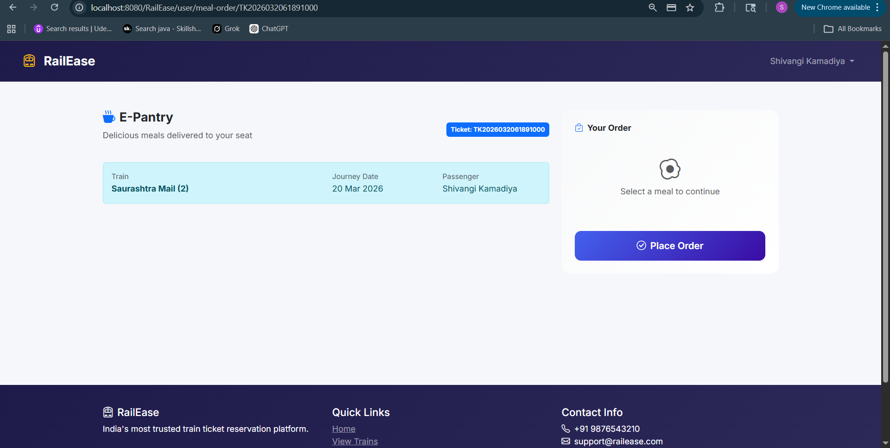

# E-Pantry Service - Restrict to Booked Tickets

## Current Work
Make E-pantry work only for users with confirmed tickets. Add backend validation in MealServiceImpl.orderMeal().

## Steps
- [ ] 1. Create TODO.md ✅
- [ ] 2. Edit src/main/java/com/railease/service/impl/MealServiceImpl.java:
  - Add ticket status validation (must be CONFIRMED)
  - Add future journey date check
  - Add train matching check
- [ ] 3. Test: Try ordering with confirmed vs cancelled ticket
- [ ] 4. Mark complete

## Key Details
- File: MealServiceImpl.java orderMeal() method (around line 131)
- Valid ticketStatus: CONFIRMED only
- Add after existing ticket ownership check (line ~147)